## Лабораторная работа №2
**Цель:** изучение сетевого интерфейса GNU-Linux.

**Задачи данной работы:**
1. Настроить ip адреса и маски подсети на двух узлах сети под ОС Debian.
2. Настроить статический ip адрес на сетевом интерфейсе в ОС Debian.
3. Настроить пересылку пакетов между сетевыми интерфейсами ОС.
4. Настроить NAT средствами iptables.

**Ход работы:**

По команде `~# ip a` мы можем посмотреть интерфейс сети, который есть на машине. 
`lo` - это первый сетевой интерфейс(локальная петля). Его настраивать не нужно.
`enp` - второй сетевой интерфейс, который мы настроим. 
С помощью команды `~# ip address add`, где сначала пишем адресс, который хотим установить, через слеш маску(можно в разных форматах), а после dev - куда устанавливаем.

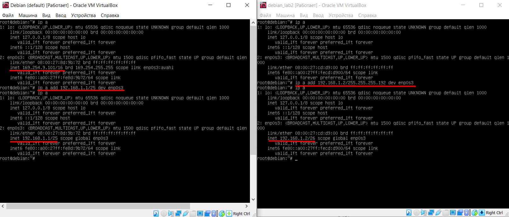

- [x] Настроить ip адреса и маски подсети на двух узлах сети под ОС Debian.

Теперь нам нужен шлюз - канал, по которому мы можем ходить за пределы сети, например, в интернет. 
Его мы установим на третей машине, которая будет подключена к нашей внутренней сети из двух машин и к интернету. Так выглядит ее сетевой интерфейс:

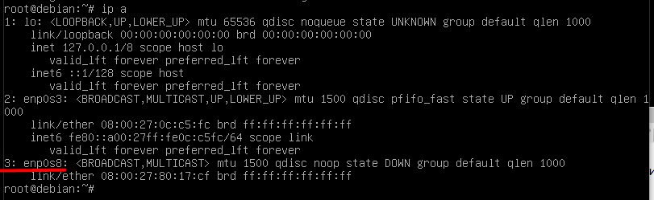

Мы видим, что появился третий интерфейс(а точнее второй, т.к. первый - это локальная петля).
Настройка второго интерфейса аналогична прошлому разу.
Настройка третьего интерфейса делается через команду:
`~# dhclient enp0s8`
Теперь этот интерфейс выглядит так и мы можем выходить в интернет:

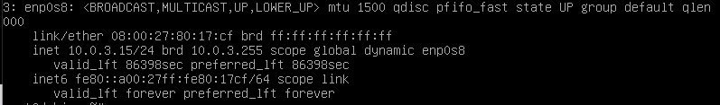

Команда `~# ip r` показывает, по каким маршрутам мы ходим:

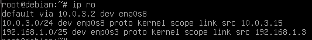

И мы видим подключение как раз к двум сетям: внутренней и внешней в интернет.
По команде `ping` мы можем проверять подключение:

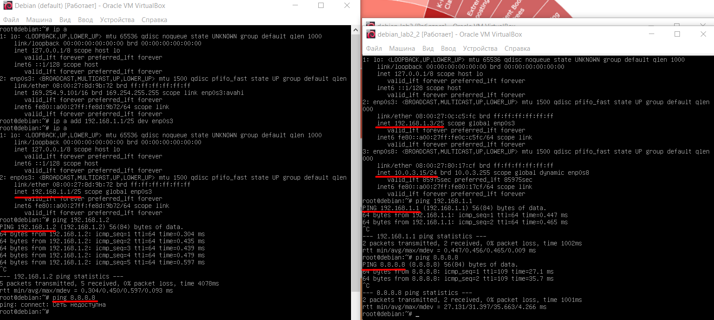

Как мы видим на картинке, машины подключены друг к другу, но только одна из них может выйти в сеть.
Теперь подключим одну из машин к шлюзу с помощью команды:
`~# ip r add default via 192.168.1.3`
Теперь ее маршруты выглядят так:

И на ней тоже можем выходить в сеть:

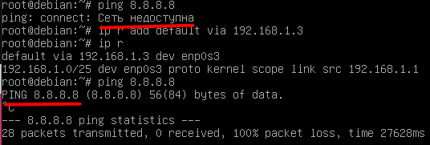

- [x] Настроить статический ip адрес на сетевом интерфейсе в ОС Debian.

Но как мы видим, мы не получаем никаких пакетов, хотя подключение прошло. 
Когда происходит подключение у машин в одном сегменте, то таких проблем нет. 
Когда мы на машине без выхода в интернет пишем команду пинг с адресом не из этой сети, то пакет переходит нашему основному шлюзу. Этот шлюз получает адрес отправителя - машины, видит адрес получателя и отсылает туда пакет.
Потом команда пинг меняет местами два адреса: отправителя и получателя - чтобы получить ответ с сервера, куда мы отослали пакет. И тут происходит загвоздка: нельзя ответить на пакет, у которого адрес отправителя - локальная сеть. Потому что в интернете ip адреса общаются внешними уникальными ip адресами.
Поэтому наш шлюз, получая пакет у одной из машин должен менять ее локальный адрес на свой внешний ip адрес для выхода в интернет (здесь это 10.0.3.15):

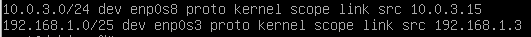

Для этой задачи нам нужно установить iptables через удаленные репозитории:
`~# apt-get update`
`~# apt-get install iptables`
Теперь мы можем получить табличку с цепочками маршрутизации:

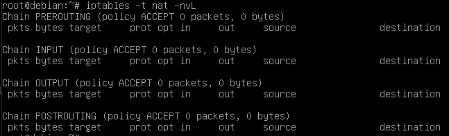

Нам нужно изменить колонку POSTROUTING.
Вызываем команду iptables, ключ (-A) говорит о добавлении правила, дальше название цепочки куда, ключ (-s) - сокращение от source указывает откуда приходит пакет (у нас это ip одной из наших машин), дальше ключом (-d) указываем куда приходит пакет(destination) - это не сеть нашей машины, т.е. мы используем отрицание перед ключом (! -d), дальше ключом (-j) указываем, что надо делать с пакетами - Masquerade (это nat в терминах iptables).
Получаем:

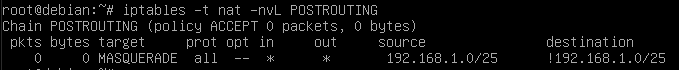

Но еще надо учитывать, что ядро гну-линукса блокирует пересылку между двумя и более сетевыми пакетами.
Это можно посмотреть так:

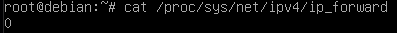

Меняем это:

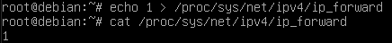

Теперь пересылка пакетов с интернетом на первой машине работает:

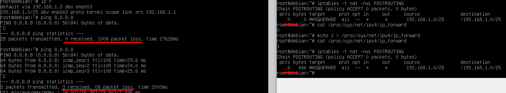

- [x] Настроить пересылку пакетов между сетевыми интерфейсами ОС
- [x] Настроить NAT средствами iptables

Теперь надо, чтобы это работало после перезагрузки.
Вручную настраиваем это в `/etc/network/interfaces`:

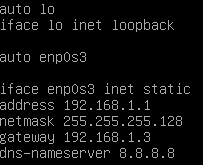

На другой машине возникла проблема и (dns-nameserver) там не работало. В таких случаях можно сделать так: заходим в файл `/etc/resolv.conf` и в ручную меняем на нужный нам адрес параметр `nameserver`.

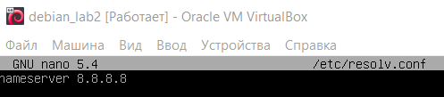

Не забываем установить все эти настройки на машину, которую используем как шлюз:

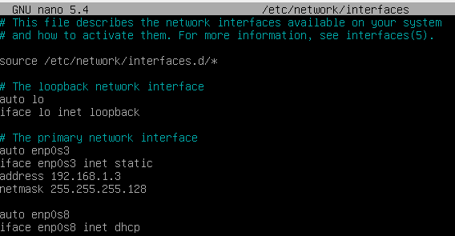

Здесь gateway уже не нужен, т.к. выход в интернет идет через третий интерфейс (enp0s8).
Не забываем, что еще нам нужно включить разрешение на пересылку двух и более пакетов, которую в прошлый раз мы включали вручную. Это делается в файле `/etc/sysctl.conf`
Нужно раскомментировать вот эту строку:

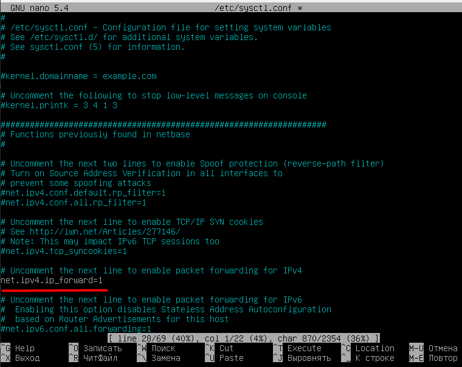

Теперь нам нужно сохранить то, что мы делали с iptables.
Для этого нам помогут команды `iptables-save` и `iptables-restore`.
Результат команды `iptables-save` заносим в нами созданный файл `iptables.init`:

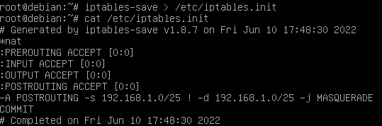

А дальше меняем файл interfaces у шлюза, добавляя команду iptables-restore по полному пути и то, откуда брать файлы на восстановление:

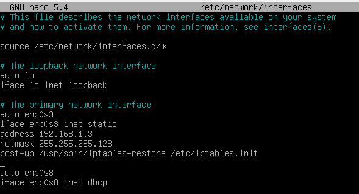

Теперь перезагружаем машины и убеждаемся, что все работает.
Итог:

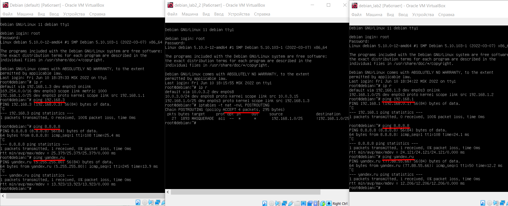
