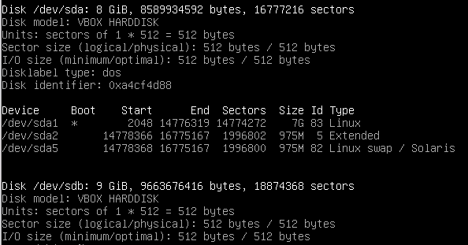
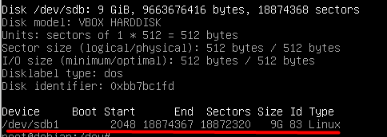
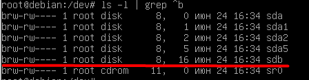
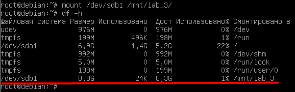
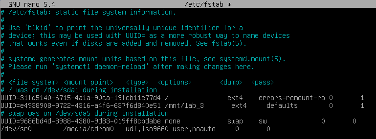
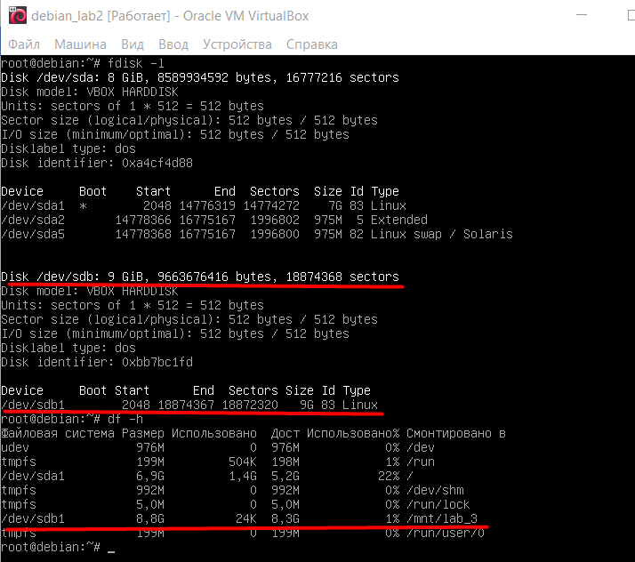

## Лабораторная работа №2
**Цель:** изучить создание разметки на новом жестком диске.

**Задачи данной работы:**
1. Добавление блочного устройства в виртуальную машину (подключение нового диска).
2. Разметка диска.
3. Создание файловой системы.
4. Монтирование/Размонтирование вручную.
5. Монтирование через файл fstab.

**Ход работы:**
В настройках виртуальной машины мы подключаем новый жесткий диск на 9гб.
Теперь в терминале с помощью команды `~# fdisk -l` мы можем посмотреть на подключенные диски:

- [x] Добавление блочного устройства в виртуальную машину (подключение нового диска).

Созданный диск на 9гб ничего дальше после размера не имеет, т.к. на нем ничего нет даже разметки.
С помощью команды `~# fdisk /dev/sdb` мы можем посмотреть разметку диска, а также создать ее. 
Эта интерактивная команда, пройдясь по которой мы создаем следующую разметку:

Причем если наш виртуальный каталок `/dev/` раньше выглядел вот так:

То теперь он выглядит так:

Т.е. раньше система хоть и опознавала наличие блочного устройства, но прочитать его не могла, т.к. там не было разметки.

- [x] Разметка диска.

Теперь нужно создать файловую систему с помощью команды `~# mkfs.ext4 /dev/sdb1`
И смонтировать ее в удобное нам место командой `~# mount`.

Командой `~# df -h` убеждаемся, что все смонтировано:

- [x] Монтирование вручную.

Однако, если перезагрузить машину, то монтирования не будет, и его придется делать заново. Чтобы этого избежать, мы изменим файл `/etc/fstab`, чтобы монтирование происходило при загрузке системы.
Вот так выглядит теперь этот файл:

UUID помогает узнать нам команда `blkid`

- [x] Монтирование через файл fstab.

**Итог после перезагрузки:**

